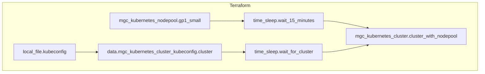

```mermaid
flowchart TD;
	subgraph Terraform
		data.mgc_kubernetes_cluster_kubeconfig.cluster["data.mgc_kubernetes_cluster_kubeconfig.cluster"]
		local_file.kubeconfig["local_file.kubeconfig"]
		mgc_kubernetes_cluster.cluster_with_nodepool["mgc_kubernetes_cluster.cluster_with_nodepool"]
		mgc_kubernetes_nodepool.gp1_small["mgc_kubernetes_nodepool.gp1_small"]
		time_sleep.wait_15_minutes["time_sleep.wait_15_minutes"]
		time_sleep.wait_for_cluster["time_sleep.wait_for_cluster"]
		data.mgc_kubernetes_cluster_kubeconfig.cluster --> time_sleep.wait_for_cluster
		local_file.kubeconfig --> data.mgc_kubernetes_cluster_kubeconfig.cluster
		mgc_kubernetes_nodepool.gp1_small --> time_sleep.wait_15_minutes
		time_sleep.wait_15_minutes --> mgc_kubernetes_cluster.cluster_with_nodepool
		time_sleep.wait_for_cluster --> mgc_kubernetes_cluster.cluster_with_nodepool
	end
```
